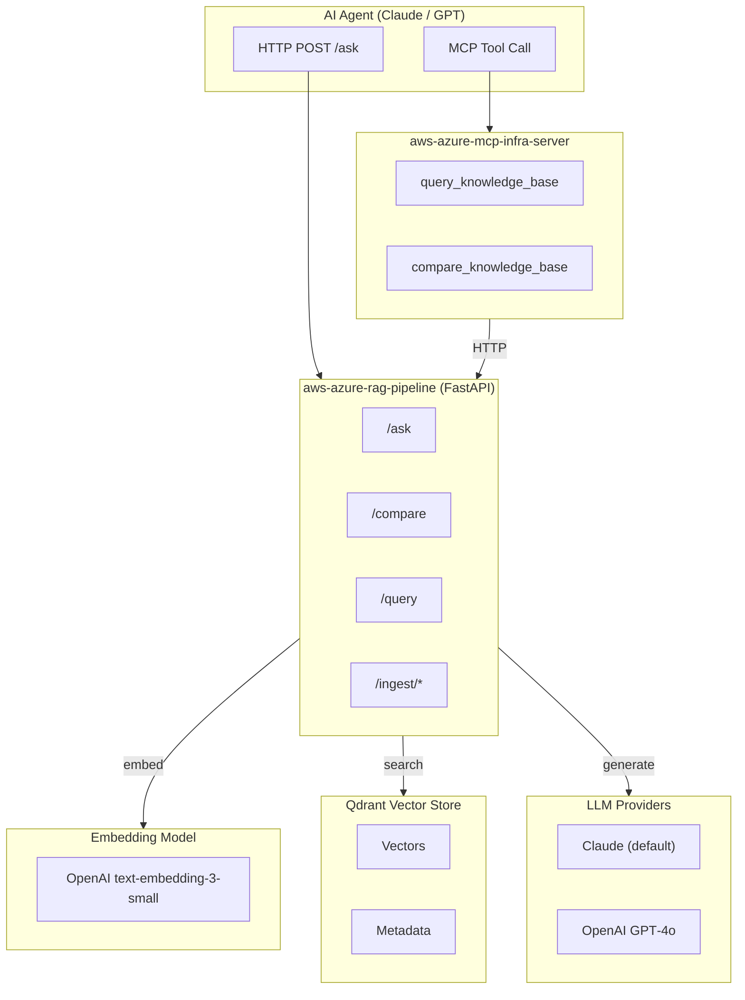
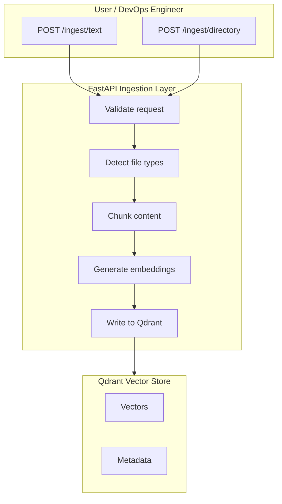
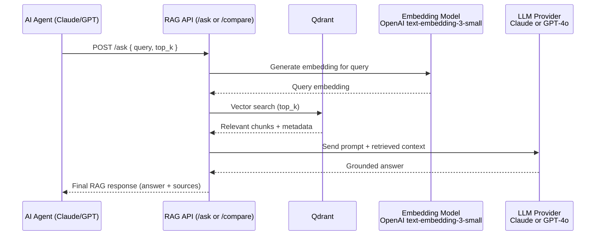

# aws-azure-rag-pipeline

A provider-agnostic retrieval-augmented generation (RAG) pipeline for infrastructure documentation and code. Gives AI agents grounded, context-aware answers about your AWS and Azure infrastructure — powered by **Anthropic Claude** or **OpenAI GPT**, switchable via a single environment variable.

Pairs with [aws-azure-mcp-infra-server](https://github.com/joshphillis/aws-azure-mcp-infra-server) — agents can call `query_knowledge_base` as an MCP tool to retrieve relevant context before taking infrastructure actions.

---

## What Makes This Different

Most RAG pipelines are hardcoded to a single LLM provider. This pipeline separates the **retrieval layer** (Qdrant vector search) from the **generation layer** (LLM), making the answer engine swappable without touching application code.

| Layer | Technology | Swappable? |
|---|---|---|
| Embeddings | OpenAI `text-embedding-3-small` | Via env var |
| Vector store | Qdrant | No |
| Answer generation | Claude (default) or GPT‑4o | Via `LLM_PROVIDER` |
| API | FastAPI | No |

---

## Architecture (Mermaid)



---

## Endpoints

| Endpoint | Method | Description |
|---|---|---|
| `/health` | GET | Liveness probe |
| `/ready` | GET | Readiness probe (checks Qdrant) |
| `/info` | GET | Collection statistics |
| `/query` | POST | Semantic search — returns raw chunks |
| `/ask` | POST | Full RAG — retrieve + generate grounded answer |
| `/compare` | POST | Full RAG — same query answered by Claude AND OpenAI in parallel |
| `/ingest/text` | POST | Ingest raw text |
| `/ingest/directory` | POST | Ingest a directory (background job) |

---

## Auto-Ingest on Startup

Set `INGEST_ON_STARTUP=true` and `INGEST_DIRS` to automatically index your infrastructure repos when the container starts.  
If the Qdrant collection already has data, ingestion is skipped.

```
INGEST_ON_STARTUP=true
INGEST_DIRS=/host-data/aws-azure-mcp-infra-server,/host-data/aws-bedrock-eks-agent-platform,/host-data/agent-platform-cicd
```

Mount your repos into the container via `docker-compose.yml`:

```yaml
volumes:
  - /your/local/path:/host-data:ro
```

### Ingestion Flow (Mermaid)



---

## Quickstart

### 1. Configure

```bash
git clone https://github.com/joshphillis/aws-azure-rag-pipeline.git
cd aws-azure-rag-pipeline
cp .env.example .env
# Add ANTHROPIC_API_KEY and OPENAI_API_KEY (or Azure OpenAI credentials)
```

### 2. Run locally

```bash
docker compose up --build
```

This starts:
- **RAG API** on port `8000`
- **Qdrant** on port `6333`

### 3. Ingest your infrastructure repos

```bash
# Ingest a local repo
curl -X POST http://localhost:8000/ingest/directory \
  -H "Content-Type: application/json" \
  -d '{"directory": "/path/to/aws-bedrock-eks-agent-platform", "repo_name": "bedrock-agent"}'

# Or ingest raw text
curl -X POST http://localhost:8000/ingest/text \
  -H "Content-Type: application/json" \
  -d '{"text": "# EKS Runbook\n...", "source": "runbooks/eks.md", "doc_type": "runbook"}'
```

### 4. Ask a question (full RAG with Claude)

```bash
curl -X POST http://localhost:8000/ask \
  -H "Content-Type: application/json" \
  -d '{
    "query": "How do I scale the EKS node group?",
    "top_k": 5,
    "provider": "claude"
  }'
```

### 5. Compare Claude vs OpenAI

```bash
curl -X POST http://localhost:8000/compare \
  -H "Content-Type: application/json" \
  -d '{
    "query": "How do I scale the EKS node group?",
    "top_k": 5
  }'
```

---

## Retrieval + Generation Sequence (Mermaid)



---

## Ask Response

```json
{
  "query": "How do I configure IRSA for EKS?",
  "answer": "Based on your infrastructure docs, IRSA is configured by...",
  "provider": "anthropic",
  "model": "claude-haiku-4-5-20251001",
  "sources": [...],
  "elapsed_seconds": 1.243
}
```

## Compare Response

```json
{
  "query": "How do I configure IRSA for EKS?",
  "claude": {
    "answer": "Based on the context...",
    "provider": "anthropic",
    "model": "claude-haiku-4-5-20251001"
  },
  "openai": {
    "answer": "According to the docs...",
    "provider": "openai",
    "model": "gpt-4o"
  },
  "elapsed_seconds": 2.1
}
```

---

## Configuration

| Variable | Description | Default |
|---|---|---|
| `LLM_PROVIDER` | Answer generation provider: `claude` or `openai` | `claude` |
| `ANTHROPIC_API_KEY` | Anthropic API key (required for Claude) | — |
| `OPENAI_API_KEY` | OpenAI API key (required for OpenAI or embeddings) | — |
| `AZURE_OPENAI_ENDPOINT` | Azure OpenAI endpoint (optional) | — |
| `AZURE_OPENAI_API_KEY` | Azure OpenAI key (optional) | — |
| `QDRANT_URL` | Qdrant connection URL | `http://localhost:6333` |
| `QDRANT_COLLECTION` | Collection name | `infra-knowledge` |
| `EMBEDDING_MODEL` | Embedding model | `text-embedding-3-small` |
| `INGEST_ON_STARTUP` | Auto-ingest repos on startup if collection is empty | `false` |
| `INGEST_DIRS` | Comma-separated list of directories to auto-ingest | — |

---

## Kubernetes Deployment

```bash
cd terraform
terraform init
terraform apply \
  -var="openai_api_key=YOUR_KEY" \
  -var="anthropic_api_key=YOUR_KEY" \
  -var="replicas=2"
```

---

## What Gets Ingested

| Content Type | Extensions | Chunking Strategy |
|---|---|---|
| Documentation | `.md` `.txt` `.rst` | Split by heading, then by ~512 tokens |
| Runbooks | `.md` files in `/runbooks` | Same as docs |
| Code | `.py` `.ts` `.go` `.tf` `.hcl` | Split by function/class, then by 100 lines |
| Config | `.yaml` `.yml` `.json` | By line count |

---

## Related Repositories

| Repo | Description |
|---|---|
| [aws-azure-mcp-infra-server](https://github.com/joshphillis/aws-azure-mcp-infra-server) | MCP server for live AWS/Azure infra + agent memory + RAG tools |
| [aws-bedrock-eks-agent-platform](https://github.com/joshphillis/aws-bedrock-eks-agent-platform) | AI agent platform on AWS Bedrock + EKS |
| [azure-openai-aks-agent-platform](https://github.com/joshphillis/azure-openai-aks-agent-platform) | AI agent platform on Azure OpenAI + AKS |
| [agent-platform-cicd](https://github.com/joshphillis/agent-platform-cicd) | CI/CD pipeline for AWS and Azure agent platforms |

---

## License

MIT
